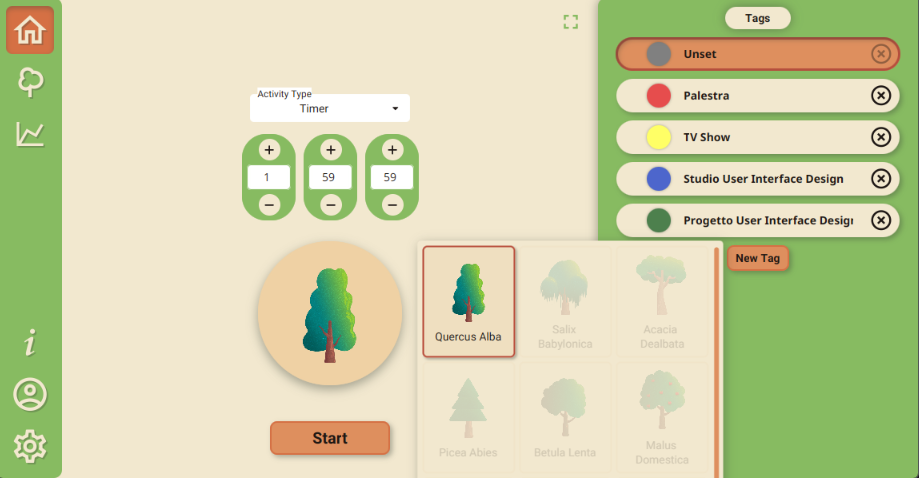
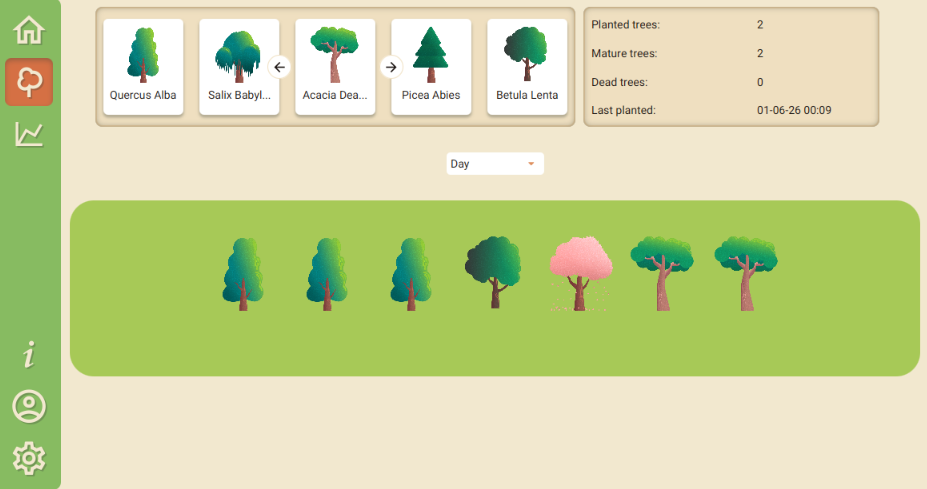
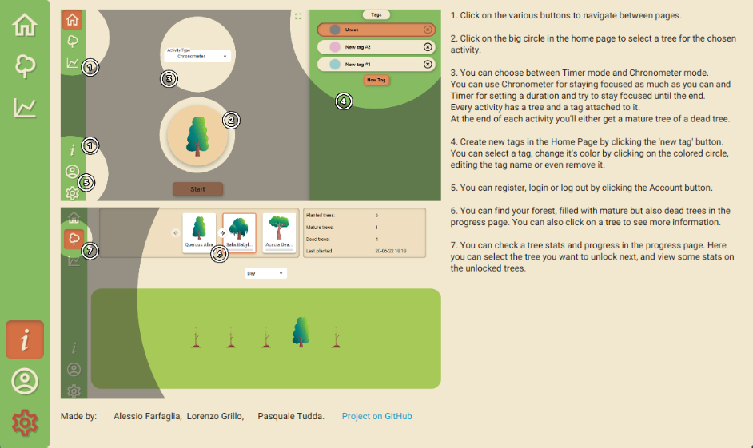

# Focus-Project

This is a JavaFX application made for the *User Interface Design* exam at "_Università della Calabria_".

Its main objective is to **help keep focus** during an activity by giving rewards in the form of trees to be planted in a virtual garden.

Keep track of progress on the [Trello Road Map](https://trello.com/b/iA6ZlC2n/focus-project).

Libraries used:

- [JavaFX](https://openjfx.io/)
- [https://github.com/palexdev/MaterialFX](https://github.com/palexdev/MaterialFX)


Inspired by the mobile app [Forest](https://www.forestapp.cc/)


## How to run

> [!IMPORTANT]  
> Make sure you have Java 17 or higher installed on your machine.

```bash
git clone https://github.com/Farfi55/Focus-Project.git
cd Focus-Project
mvn clean javafx:run
```

## Screenshots






