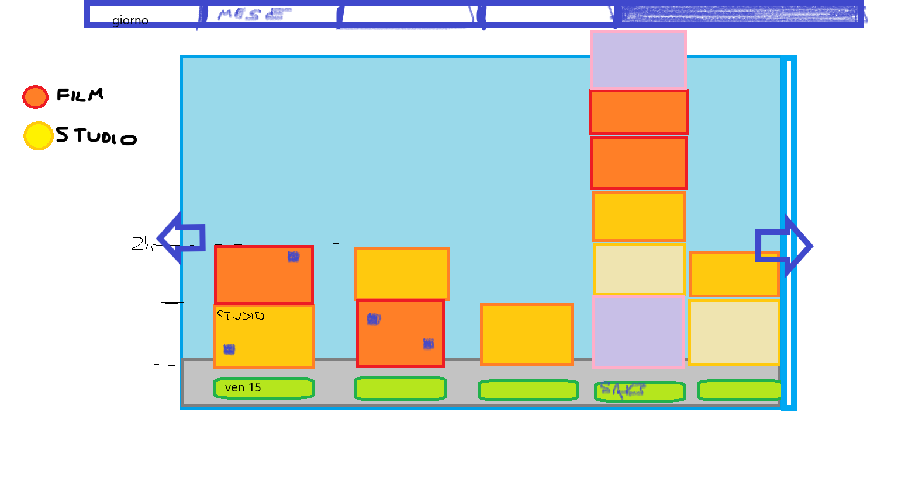
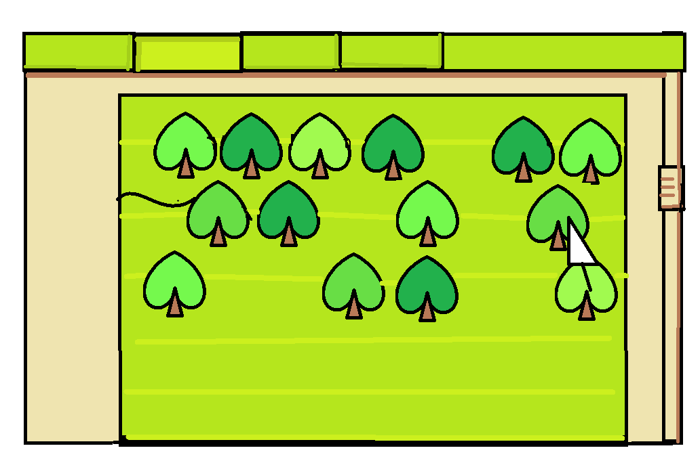
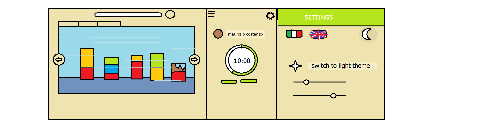

# Design Focus Project

> inspired by "Forest" app

- [Design Focus Project](#design-focus-project)
  - [Pagine applicazione](#pagine-applicazione)
    - [Pagina principale](#pagina-principale)
    - [Pagina progresso](#pagina-progresso)
    - [Login - registrazione](#login---registrazione)
    - [impostazioni](#impostazioni)
    - [FAQ](#faq)
    - [Core concept](#core-concept)
    - [? pagina amici](#-pagina-amici)
  - [Navigazione](#navigazione)
  - [UX dal primo momento](#ux-dal-primo-momento)
    - [Short term reward](#short-term-reward)
  - [Obbiettivi](#obbiettivi)
  - [Feature essenziali](#feature-essenziali)
    - [feature secondarie](#feature-secondarie)
    - [Possibili temi](#possibili-temi)

## Pagine applicazione

- pagina Home
  - timer
  - cronometro
- pagina progresso
  - selezione 
- pagina statistiche
- pagina tags
- pagina help
  - scorciatoie
- pagina impostazioni
  - 

### Pagina principale

- Timer-orologio
- Tempo di concentrazione giornaliero
- Selezione tempo di 
- Rappresentazione animata progresso
  <!-- - stadio base ("pre inizio")
  - fase crescita (animata) **da considerare**
  - fase finale successo (uguale a quella nel progresso)
  - fase finale fall -->
  - timer completato
  - timer fallito

### Pagina progresso

visualizzazione Progressi in base al raggio temporale (giorno, settimana, mese, anno)

possibili implementazioni

1. Tema Città
   1. "Giorno per Giorno", "mese per mese" ...
      1. la rappresentazione *giorno* è la più "piccola" dei dati, disponendo in ordine cronologico il tempo impiegato su ogni determinata task (più alto è il bloccco, maggior tempo è stato impiegato)
      2. la rappresentazione *settimana* viene dopo di quella giornaliera, si può effettuare il focus di una settimana cliccando sulla torre, si verrà portati alla rappresentazione inferiore (in questo caso giorno)
      3. dalla rappresentazione *settimana* in poi, le torri sono formate da blocchi che sono la somma del tempo impiegato per ogni tag 

   2. "Interno giorno"
      1. simile a giorno per giorno, ma si può visualizzare il giorno, settimana, mese, ..., corrente

- Tema Foresta
  - visualizzazione (griglia 2D o isometrica), un albero sano per ogni task completata, uno secco per ogni task abbandonata prima dello scadere del tempo.
  - Tipi di visualizzazione:
    - giorno
    - settimana
    - mese
    - anno
  - Cliccando su un albero si apre una finestra pop-up con indicato il tempo impiegato nella task, il tipo di albero, il tag e se la task è stata completata o meno.

### Login - registrazione

altra finestra che prende il focus, di base su Login, cliccando su un pulsante si passa alla registrazione

filtri password usando le regex, mostrando all'utente i filtri che falliscono

### impostazioni

### FAQ

Frequently asked questions

- Quali modalità per tenere traccia del tempo ci sono?
- A cosa servono i tag?
- Come si crea un tag?
- Come si elimina un tag?
- Dove posso vedere le statistiche?
- Dove trovo le impostazioni?
- Come posso cambiare tra tema chiaro e quello scuro?

### Core concept

### ? pagina amici

Se è stato effettuato il login  viene visuaizzata la lista amici con la classifica del tempo di concentrazione, altrimenti viene rimandato l'utente alla schermata di login (o di registrazione se non ha mia loggato).

___

## Navigazione

## UX dal primo momento

l'utente entra nell'app, dopo del caricamento viene presentato con la pagina principale oppure il core concept
viene data libertà di esporazione dell'app, senza richiedere l'accesso fino al momento in cui l'utente utilizza una funzione
che lo richiede, quali:

- sincronizzazione dati
- interazione amici

...

### Short term reward

- ogni volta che finisce una TASK si aggiunge una sua rappresentazione nella pagina progresso
- ogni *task completato* si ottiene una ricompensa in monete

## Obbiettivi

- accessibilità
- semplicità d'uso
- only keyboard mode
- Libertà di esplorazione
  - login solo una volta necessario
    - sincronizzazione dati
    - ? amici
- Feedback sonoro
  
## Feature essenziali

- Statistiche
  - tempo di *focus* totale
  - tempo di *focus* giornaliero/settimanale/mensile
  - *focus* thrend
    - comparazione tra diversi giorni a distanze prestabilite
- Rappresentazione statistiche
  - distribuzione in base al *tag*
- Supporto Tag
  - creazione/eliminazione tag
  - tag base (nullo)
- Supporto multi-lingua 
  - italiano 
  - inglese
- Salvataggio progressi
  - sincronizzazione progressi tra locale-cloud
  - su database
  - Caricamento progressi
  - Cancella progressi
- Impostazioni
  - su file
  - lingua
  - tema
  - impostazioni audio
- Short-cut
  - lista di short-cut
- Easter Eggs :egg: :rabbit:

### feature secondarie 

- tema light - dark
- FAQ
- Modallità Focus-Break (metodo pomodoro)
- Frasi motivazionali
- Musica di sottofondo
- Core concept
  - tutorial
<!-- - shop con cose aquistabili utilizzando le monete ottenute dai task
  - alberi
  - suono di task completata -->
- amici
  - classifica amici
- Achievement
- shortcut-modificabili
- supporto tag con emoji

### Possibili temi

- Foresta
  - 
  - arboscello
  - pianta cresiuta
- Foresta Minecraft
- Orto di zio
- Città
  - 
- Acquario
- Zoo
